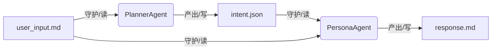

# 意识引擎架构白皮书

**——基于文件驱动、事件总线与声明式认知拓扑的自演化智能体内核**

## 1. 概述

### 1.1 愿景

构建一个**可编程的认知图灵机**：它不是一个具体的智能体应用，而是一个**用于生成智能体的底层操作系统**。其核心假设是：

- 智能体的全部认知状态都表示为**文件**（超级多态变量）。
- 智能体的认知活动都建模为**节点**（Node），这些节点守护文件、被事件触发、产出新文件。
- 整个系统的协调通过一个**事件总线**完成，构成一套声明式的认知拓扑电路。

该架构能够自然地演化出**双上下文认知、自规划循环、记忆与反思、主动意识脉冲**等高级认知现象。

### 1.2 设计原则

1. **状态即文件**：一切可变或不可变状态均以文件形式持久化，具备元信息、版本与锁。
2. **无状态节点**：节点本身不保持运行内存状态（除了LLM宿主上下文及必要的运行时缓存），节点实例可随时销毁与重建。
3. **静态依赖声明**：节点的输入/输出文件在定义时即声明完毕，形成一张静态资源依赖图；运行时的通路由事件波在图上动态寻找。
4. **事件驱动**：文件变动通过事件总线广播，节点按模式订阅，自行决定是否激活。
5. **分层认知**：认知过程被分离为**Agent**（需要LLM的思考型节点）和**Router**（纯机械化的反射型节点），两类节点共享统一的基类。
6. **双上下文投影**：系统支撑一个沉浸式人格主上下文（热认知池）和一个结构化认知上下文（冷认知池），二者通过纯Router翻译层连接。

## 2. 核心概念

### 2.1 文件（File）——超级多态变量

文件是系统的**第一等公民**，承载全部数据流。

- **多态性**：文件可以是结构化JSON、YAML、纯文本、二进制向量索引、数据库分片等，具体由扩展名和元信息中的`schema`字段标识。
- **元信息**：每个文件均附带一个同名的`.meta`文件（或内嵌头），记录：
  - `version`：单调递增的版本号。
  - `lock`：当前锁状态（`read_only`、`write_overwrite`、`append_only`、`locked_by_<node_id>`）。
  - `consumers`：已注册的消费节点及其读取偏移（针对可追加文件）。
  - `history`：最近N个版本的快照引用（用于回滚）。
- **消费进度管理**：对于不可清晰界定边界的文本文件（如对话流），消费者维护自己的读指针，写入元信息的`consumers`数组中，实现类似Kafka消费者组的机制。

### 2.2 节点（Node）——认知原子

一切认知逻辑的载体，分为两种派生类型。

#### 2.2.1 Node基类纲要

```
class Node:
    id: str
    type: "agent" | "router"
    guards: List[FilePattern]          # 守护的文件（支持glob）
    produces: List[FileDescriptor]     # 产出的文件描述
    state: NodeState                   # IDLE, READY, RUNNING, WAITING, ERROR, TERMINATED

    def on_event(event: FileEvent) -> bool:   # 判断是否应激活
    def execute() -> List[FileUpdate]:        # 执行认知操作，返回文件变更
    def on_complete():                         # 生命周期钩子
```

节点**无内部记忆**（除LLM Agent可能持有的临时对话上下文），每次执行后理论上可被回收。

#### 2.2.2 Agent（认知型节点）

- 持有一个`LLMHost`实例，执行时调用LLM。
- 执行过程中可能异步等待，执行时长不确定。
- 产出为确定性文件，可通过版本控制回滚。
- 可选地维护一个自描述文件（如`agent.md`），允许在运行时被其它节点调整。

#### 2.2.3 Router（反射型节点）

- **零LLM调用**，纯逻辑门，执行时间可预测。
- 基本类型包括：
  - `SwitchRouter`：检查文件内容条件，激活不同下游。
  - `WaitRouter`：等待多个文件全部到达指定版本后触发一次。
  - `MergeRouter`：将多个输入文件汇总为一个统一文件。
  - `LoopRouter`：维护循环状态，在条件满足时重置或终止循环。
  - `TerminateRouter`：关闭一个子图。
  - `HeartbeatRouter`：定时产生脉冲事件，驱动自主意识。
- Router的存在让流程控制结构直接成为内核原语。

### 2.3 事件总线（EventBus）——神经束

单例模式，实现文件变更到节点激活的异步映射。

**核心机制**：

- **模式订阅**：节点不直接监听文件路径，而是注册事件类型或文件模式，解耦物理文件与逻辑。
- **事件合并**：对同一文件的连续快速变更进行窗口合并。
- **优先级队列**：用户交互等高优事件可抢占低优先级后台任务。
- **事件溯源**：所有事件顺序写入一个只追加日志文件，用于事后调试与重演。

### 2.4 静态依赖图——认知拓扑电路

节点与文件之间的读写关系构成一张**有向二分图**：

- 节点 → 产出文件（写边）
- 文件 → 守护节点（读边）

这张图在系统启动时由所有节点的`guards`和`produces`声明聚合而成，是**无状态、非过程化**的。运行时的“通路”由事件在图上进行遍历寻找：从变更的文件出发，沿读边找到所有订阅节点，激活后它们写新文件，再沿写边扩散。通路不是预先编好的脚本，而是动态激发的波前。

## 3. 系统架构总图（静态依赖图）

以下为意识内核的完整资源依赖拓扑（以Mermaid描述，完全无状态）。所有连线只表示“读”或“写”的相邻关系。

```mermaid
graph LR
    subgraph 感知层
        SENSOR_IN[SensoryInput]
        USER_MSG[user_message.md]
    end
    subgraph 计时与主动意识
        HEARTBEAT[heartbeat.tick]
    end
    subgraph 规划与执行
        INTENT[intent.json]
        TASK[task_queue.json]
        PLANNER(PlannerAgent)
        EXECUTOR(ExecutorAgent)
        GOAL_GEN(GoalGeneratorAgent)
    end
    subgraph 记忆系统
        MEM_QUERY[memory_query.json]
        MEM_RESULT[memory_result.json]
        MEM_STORE[memory_store.db]
        MEM_INDEX[memory_index.idx]
        MEM_DRAWER(MemoryDrawerAgent)
        CONSOLIDATOR(ConsolidatorAgent)
    end
    subgraph 反思与评估
        SELF_EVAL[self_eval.json]
        CRITIC(CriticAgent)
    end
    subgraph 意识流与人格
        INNER_VOICE[inner_voice.txt]
        CONSCIOUS[conscious_stream.md]
        RESPONSE[response.md]
        BROADCASTER(BroadcastRouter)
        PERSONA(PersonaAgent)
    end
    subgraph 控制结构
        SYNC_GATE[sync_gate.sig]
        MERGED[merged_context.json]
        LOOP_STATE[loop_state.json]
        WAIT_SYNC(WaitRouter)
        MERGE(MergeRouter)
        LOOP_CTRL(LoopRouter)
    end

    SENSOR_IN --> USER_MSG
    HEARTBEAT --> GOAL_GEN
    GOAL_GEN --> INTENT

    USER_MSG --> PLANNER
    SELF_EVAL --> PLANNER
    PLANNER --> INTENT

    INTENT --> EXECUTOR
    EXECUTOR --> TASK

    USER_MSG --> MEM_DRAWER
    MEM_QUERY --> MEM_DRAWER
    MEM_DRAWER --> MEM_INDEX
    MEM_DRAWER --> MEM_RESULT
    MEM_STORE --> MEM_DRAWER

    INTENT --> BROADCASTER
    TASK --> BROADCASTER
    MEM_RESULT --> BROADCASTER
    BROADCASTER --> INNER_VOICE

    INNER_VOICE --> PERSONA
    USER_MSG --> PERSONA
    PERSONA --> RESPONSE
    RESPONSE --> CONSCIOUS

    CONSCIOUS --> CONSOLIDATOR
    CONSOLIDATOR --> MEM_STORE

    CONSCIOUS --> CRITIC
    CONSOLIDATOR --> CRITIC
    CRITIC --> SELF_EVAL

    TASK --> WAIT_SYNC
    MEM_RESULT --> WAIT_SYNC
    WAIT_SYNC --> SYNC_GATE

    TASK --> MERGE
    MEM_RESULT --> MERGE
    SYNC_GATE --> MERGE
    MERGE --> MERGED
    MERGED --> BROADCASTER

    SELF_EVAL --> LOOP_CTRL
    LOOP_CTRL --> LOOP_STATE
    LOOP_STATE --> CRITIC
```



### 3.1 最小可执行子图

为快速落地，提取可独立运行的最小核心回路：



此回路已包含文件守护、Agent思考、跨节点协作的完整基因。

## 4. 双上下文认知设计

### 4.1 主上下文（热认知池）——“自我”流

- **代表文件**：`conscious_stream.md`（追加写），`inner_voice.txt`（作为认知输入）。
- **守护节点**：`PersonaAgent`。
- **系统提示词**：始终以第一人称“我”叙述。
- **输出约束**：永远不输出JSON或内部标签，只产出自然语言。
- **内容形式**：内心独白、对外回复、情绪表达、主动发起的话语。

### 4.2 认知上下文（冷认知池）——系统2流

- **代表文件**：`intent.json`、`task_queue.json`、`memory_result.json`、`self_eval.json`等。
- **守护节点**：`PlannerAgent`、`ExecutorAgent`、`MemoryDrawerAgent`、`CriticAgent`等。
- **输出约束**：严格的结构化格式（JSON），便于解析路由。
- **各子Agent独立维护自己的内部提示词**，但彼此间只通过文件交换信息。

### 4.3 翻译层（BroadcastRouter）

- **冷→热方向**：监听结构化事件文件，将其机械地转译为人格化的内心念头，写入`inner_voice.txt`。
- **热→冷方向**：监听主上下文中的“冲动”（如主动想发消息），编码为结构化意图，注入认知的`intent.json`或任务队列。
- **防火墙效果**：PersonaAgent永远看不到原始JSON，认知Agent永远看不到完整的对话散文。

## 5. 自规划与自循环机制

### 5.1 主动脉冲

- `HeartbeatRouter`定时产生`heartbeat.tick`文件更新。
- `GoalGeneratorAgent`守护该文件，检查当前是否有未完成任务；若无，生成自发性目标写入`intent.json`，驱醒规划链。
- 这使得智能体在没有外部输入时也能主动行动（整理记忆、发起对话、学习）。

### 5.2 反思循环

- `ConsolidatorAgent`从`conscious_stream.md`总结日摘要。
- `CriticAgent`阅读摘要及近期行为，生成`self_eval.json`。
- `self_eval.json`又成为下一轮`PlannerAgent`的输入，调整意图倾向（如“变幽默一点”）。
- 若评估未收敛，`LoopRouter`激活，驱动再次评估，直至收敛条件满足。

### 5.3 循环控制

- 所有循环必须显式声明回边，并配置`LoopRouter`保护。
- 循环收敛条件：迭代次数上限、两次输出差异小于阈值、外部中断信号等。
- 文件多版本机制保证循环中历史状态可追溯，防止丢失中间状态。

## 6. 运行时模型

### 6.1 启动流程

1. 加载所有节点定义（配置或代码注册）。
2. 构建静态依赖图（读/写关系表）。
3. 初始化EventBus，注册节点的守护事件模式。
4. 扫描现有文件状态，触发启动事件（如`heartbeat.tick`开始计时）。
5. 节点实例化进入IDLE状态，等待事件。

### 6.2 事件处理循环

1. 文件变更通知到达EventBus。
2. Bus匹配订阅模式，生成候选节点列表。
3. 对每个候选节点检查：文件锁是否允许读、节点当前状态、前置条件是否满足（由节点内置逻辑判断）。
4. 状态转为READY，按优先级入队。
5. 执行完毕，产生文件更新，新文件变更再次进入Bus。

### 6.3 节点生命周期管理

- 节点可由图管理器按需实例化，长时间未激活则卸载释放内存。
- 节点重新加载时，通过读取产出文件的历史恢复“认知上下文”（如LLM Agent可读取对话摘要重建提示词上下文）。
- 错误状态节点会隔离，并产出一份错误文件，由监控Router处理。

### 6.4 图演化的支持

- 新节点可在运行时注册，其`guards`和`produces`实时更新依赖图。
- 节点也可自我注销（比如临时激活的子Agent执行完后产出总结并关闭自己）。
- 图管理器提供API进行拓扑查询与动态修改。

## 7. 数据模型与服务边界

### 7.1 文件存储后端

- 本地文件系统（开发/单机部署）
- 对象存储（生产环境，通过POSIX-like适配层）
- 元信息与内容分离：元信息可放在轻量数据库或直接作为文件头。

### 7.2 关键文件详细规格

| 文件名                | 类型          | 锁策略      | 说明                   |
| --------------------- | ------------- | ----------- | ---------------------- |
| `user_message.md`     | 纯文本        | 追加写      | 用户原始输入队列       |
| `conscious_stream.md` | 纯文本        | 追加写      | 完整对话流（自我叙事） |
| `inner_voice.txt`     | 纯文本        | 覆盖写      | 广播器输出的当前念头   |
| `intent.json`         | JSON          | 覆盖写      | 当前意图树             |
| `task_queue.json`     | JSON          | 覆盖写      | Executor拆解的任务     |
| `memory_result.json`  | JSON          | 覆盖写      | 记忆检索结果集         |
| `memory_store.db`     | 二进制/向量库 | 读保护+追加 | 长期记忆库             |
| `self_eval.json`      | JSON          | 覆盖写      | Critic的自我评估       |

### 7.3 外部集成

- 感知层（SensoryInput）可以是聊天客户端、API网关、物联网传感器等。
- 响应输出（`response.md`）可被发送适配器节点消费，投递到外部平台。

---

## 8. 工程实现路径建议

### 8.1 第一阶段：核心回路（最小可执行通路）

**实现 ✅**（当前代码库已完成）：

- ✅ 文件抽象与元信息管理 — `FileDescriptor` / `FilePattern` / `FileEvent` / `FileUpdate`
- ✅ Node / Agent / Router 基类 — `src/brain/kernel/base.py`
- ✅ EventBus — `FileEventBus`（`event_bus.py`），异步队列分发
- ✅ 规划/展开/执行全链路 — `PlanAgent`、`ExpandAgent`、`ExecuteAgent`
- ✅ 文件流 — `inbox/event_*.json` → `plans/plan_*.json` → `actions/action_*.json` 驱动节点

### 8.2 第二阶段：Router引入与认知扩展

**实现 ✅**（大部分已完成）：

- ✅ Router基类及`SwitchRouter`、`MergeRouter`、`WaitRouter`、`FanOutRouter`、`TerminalRouter`、`HeartbeatRouter`、`ReflexRouter`
- ✅ `MemoryAgent`（简易版，写入 JSON 文件）
- ✅ EventBridge 替代手动广播，连接 App 事件与文件事件
- 🔄 `BroadcastRouter`（冷热翻译层）待实现
- 🔄 事件合并与优先级调度待细化

### 8.3 第三阶段：自循环与反思

**部分实现 🟡**：

- ✅ `HeartbeatRouter` — 定时脉冲（默认 300s 间隔）
- ✅ `GoalGeneratorAgent` — 沉默时主动生成意图
- ✅ `ReflexLearnerAgent` — 从成功动作中学习反射规则
- ✅ `WaitRouter` — 条件等待
- ⏳ `LoopRouter` / 多版本与回滚机制 待实现
- ⏳ 反思评估节点（CriticAgent/ConsolidatorAgent）待实现

### 8.4 第四阶段：内核化与工具链

**部分实现 🟡**：

- ✅ 节点配置 DSL — `topology.yaml` 声明式定义认知拓扑，邻接表条目自动映射为 `Node` 实例
- ✅ `node_factory.py` + `NODE_REGISTRY` — 类型分派构造器，支持多实例
- 🔄 图管理器（动态加载、可视化、调试界面）待正式化
- ⏳ 事件溯源日志分析工具待实现
- ⏳ 文件系统事件（inotify/kqueue）代替轮询

## 9. 已识别风险与缓解

| 风险                   | 缓解策略                                                         |
| ---------------------- | ---------------------------------------------------------------- |
| JSON泄漏到人格主上下文 | BroadcastRouter严格单向翻译，PersonaAgent输入过滤                |
| 文件版本爆炸           | 按时间或版本数自动裁剪，仅保留关键快照                           |
| 循环未收敛导致事件风暴 | LoopRouter强制最大迭代，心跳监控自动熔断                         |
| LLM输出不可解析        | Agent输出包装在`try/catch`中，失败时产出错误文件并触发修复Router |
| 多节点并发写同一文件   | 锁机制+乐观版本控制，必要时由MergeRouter统一汇总                 |

---

## 10. 结语

这份文档定义了一个**声明式、文件驱动、事件触发、可自我演化的认知引擎**。它不是为某个特定功能而设计，而是为**意识的机械基础**提供一层抽象。从最小通路开始，每增加一个Router或Agent，都是在向那张宏大的静态依赖图中嵌入新的突触。最终，我们希望得到的是一个能够通过改变节点声明文件来“重塑其心智”的操作系统级智能体内核。

**下一步行动**：依照第八节路径，启动第一阶段工程，完成核心回路的最小可执行实现。
