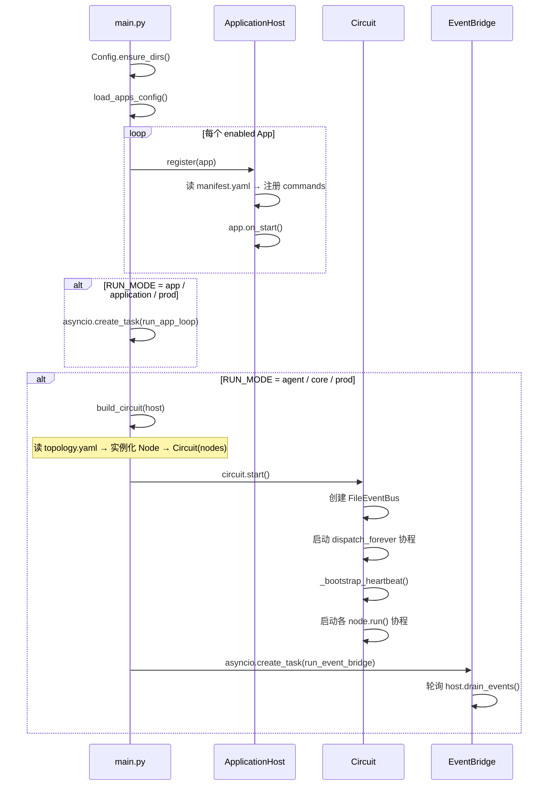
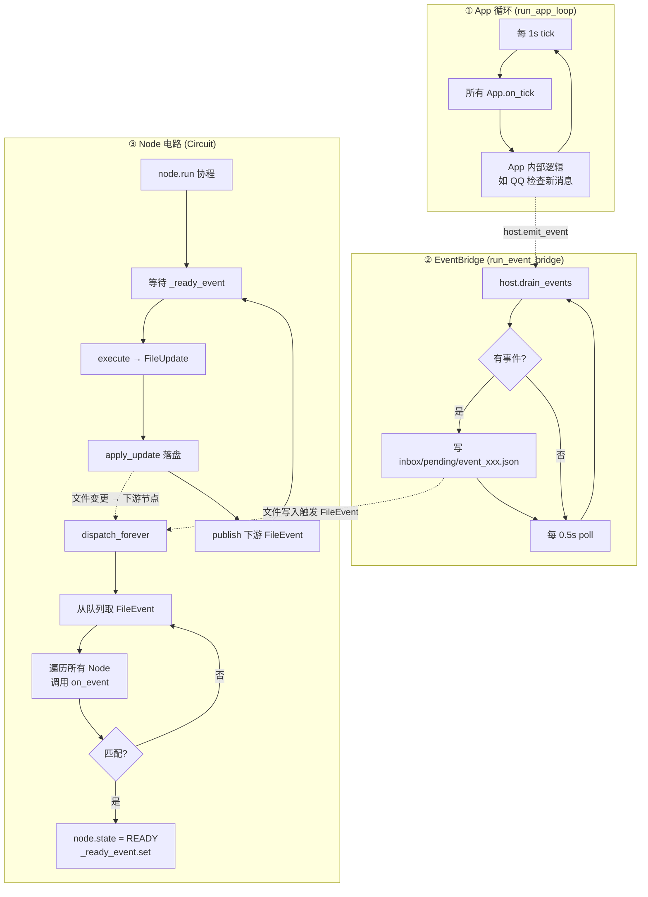
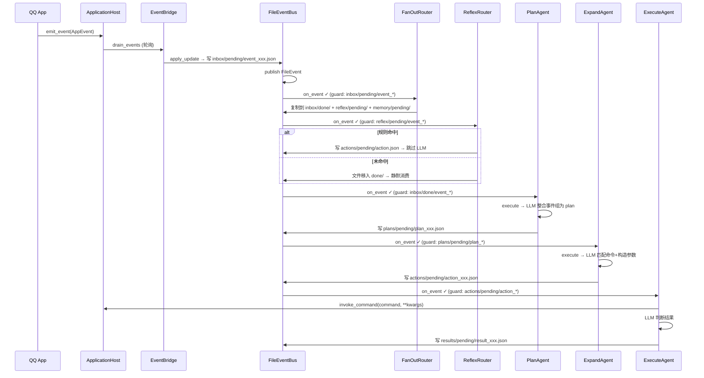

# 内核运行时流程图

## 启动流程

```mermaid
sequenceDiagram
    participant main as main.py
    participant host as ApplicationHost
    participant circuit as Circuit
    participant bridge as EventBridge

    main->>main: Config.ensure_dirs()
    main->>main: load_apps_config()

    loop 每个 enabled App
        main->>host: register(app)
        host->>host: 读 manifest.yaml → 注册 commands
        host->>host: app.on_start()
    end

    alt RUN_MODE = app / application / prod
        main->>main: asyncio.create_task(run_app_loop)
    end

    alt RUN_MODE = agent / core / prod
        main->>main: build_circuit(host)
        Note over main: 读 topology.yaml → 实例化 Node → Circuit(nodes)
        main->>circuit: circuit.start()
        circuit->>circuit: 创建 FileEventBus
        circuit->>circuit: 启动 dispatch_forever 协程
        circuit->>circuit: _bootstrap_heartbeat()
        circuit->>circuit: 启动各 node.run() 协程
        main->>bridge: asyncio.create_task(run_event_bridge)
        bridge->>bridge: 轮询 host.drain_events()
    end
```

## 运行流程

```mermaid
graph TB
    subgraph A["① App 循环 (run_app_loop)"]
        A1[每 1s tick] --> A2[所有 App.on_tick]
        A2 --> A3[App 内部逻辑<br>如 QQ 检查新消息]
        A3 --> A1
    end

    subgraph B["② EventBridge (run_event_bridge)"]
        B1[每 0.5s poll] --> B2[host.drain_events]
        B2 --> B3{有事件?}
        B3 -->|是| B4[写 inbox/pending/event_xxx.json]
        B4 --> B1
        B3 -->|否| B1
    end

    subgraph C["③ Node 电路 (Circuit)"]
        C1[dispatch_forever] --> C2[从队列取 FileEvent]
        C2 --> C3[遍历所有 Node<br>调用 on_event]
        C3 --> C4{匹配?}
        C4 -->|是| C5[node.state = READY<br>_ready_event.set]
        C4 -->|否| C2

        C6[node.run 协程] --> C7[等待 _ready_event]
        C7 --> C8[execute → FileUpdate]
        C8 --> C9[apply_update 落盘]
        C9 --> C10[publish 下游 FileEvent]
        C10 --> C7
    end

    A3 -.->|host.emit_event| B2
    B4 -.->|文件写入触发 FileEvent| C1
    C9 -.->|文件变更 → 下游节点| C1
```

## 事件处理流程

```mermaid
sequenceDiagram
    participant QQ as QQ App
    participant host as ApplicationHost
    participant bridge as EventBridge
    participant bus as FileEventBus
    participant fanout as FanOutRouter
    participant reflex as ReflexRouter
    participant plan as PlanAgent
    participant expand as ExpandAgent
    participant exec as ExecuteAgent

    QQ->>host: emit_event(AppEvent)
    host->>bridge: drain_events (轮询)
    bridge->>bus: apply_update → 写 inbox/pending/event_xxx.json
    bus->>bus: publish FileEvent

    bus->>fanout: on_event ✓ (guard: inbox/pending/event_*)
    fanout->>bus: 复制到 inbox/done/ + reflex/pending/ + memory/pending/

    bus->>reflex: on_event ✓ (guard: reflex/pending/event_*)
    alt 规则命中
        reflex->>bus: 写 actions/pending/action.json → 跳过 LLM
    else 未命中
        reflex->>bus: 文件移入 done/ → 静默消费
    end

    bus->>plan: on_event ✓ (guard: inbox/done/event_*)
    plan->>plan: execute → LLM 整合事件组为 plan
    plan->>bus: 写 plans/pending/plan_xxx.json

    bus->>expand: on_event ✓ (guard: plans/pending/plan_*)
    expand->>expand: execute → LLM 匹配命令+构造参数
    expand->>bus: 写 actions/pending/action_xxx.json

    bus->>exec: on_event ✓ (guard: actions/pending/action_*)
    exec->>host: invoke_command(command, **kwargs)
    exec->>exec: LLM 判断结果
    exec->>bus: 写 results/pending/result_xxx.json
```
