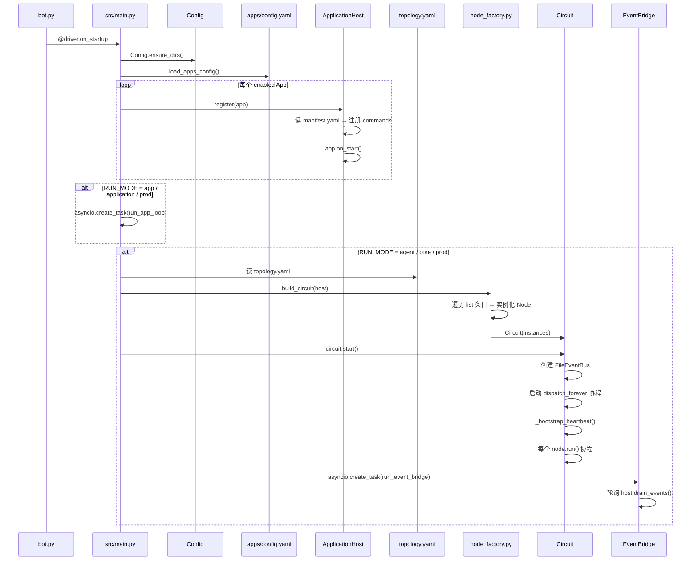
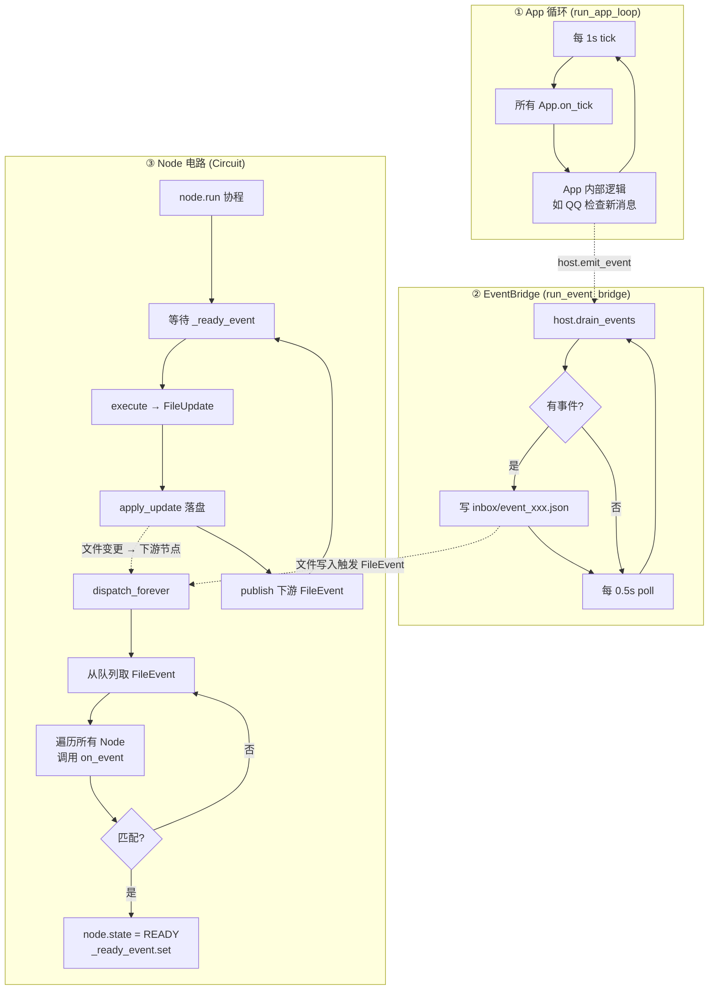
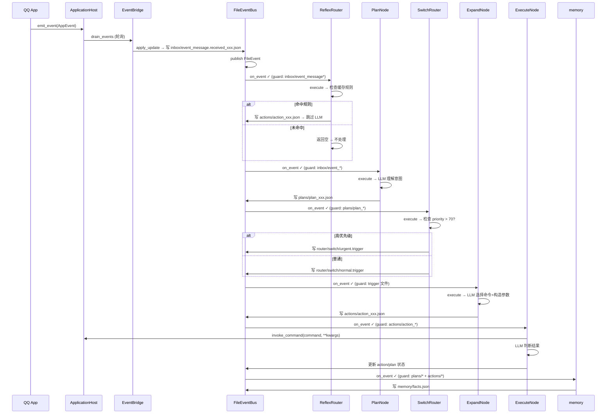
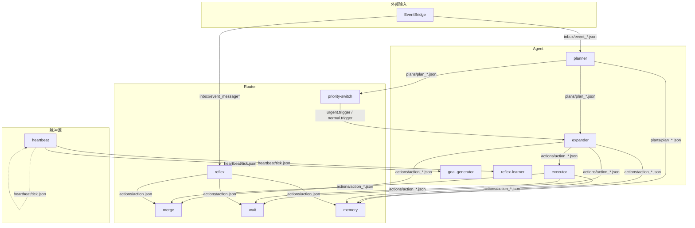

# 内核运行时的一些流程图

## 启动流程

```mermaid
sequenceDiagram
    participant bot as bot.py
    participant main as src/main.py
    participant cfg as Config
    participant app_cfg as apps/config.yaml
    participant host as ApplicationHost
    participant topo as topology.yaml
    participant factory as node_factory.py
    participant circuit as Circuit
    participant bridge as EventBridge

    bot->>main: @driver.on_startup
    main->>cfg: Config.ensure_dirs()
    main->>app_cfg: load_apps_config()

    loop 每个 enabled App
        main->>host: register(app)
        host->>host: 读 manifest.yaml → 注册 commands
        host->>host: app.on_start()
    end

    alt RUN_MODE = app / application / prod
        main->>main: asyncio.create_task(run_app_loop)
    end

    alt RUN_MODE = agent / core / prod
        main->>topo: 读 topology.yaml
        main->>factory: build_circuit(host)
        factory->>factory: 遍历 list 条目 → 实例化 Node
        factory->>circuit: Circuit(instances)
        main->>circuit: circuit.start()

        circuit->>circuit: 创建 FileEventBus
        circuit->>circuit: 启动 dispatch_forever 协程
        circuit->>circuit: _bootstrap_heartbeat()
        circuit->>circuit: 每个 node.run() 协程

        main->>bridge: asyncio.create_task(run_event_bridge)
        bridge->>bridge: 轮询 host.drain_events()
    end
```

## 运行流程

```mermaid
graph TB
    subgraph "① App 循环 (run_app_loop)"
        A1[每 1s tick] --> A2[所有 App.on_tick]
        A2 --> A3[App 内部逻辑<br>如 QQ 检查新消息]
        A3 --> A1
    end

    subgraph "② EventBridge (run_event_bridge)"
        B1[每 0.5s poll] --> B2[host.drain_events]
        B2 --> B3{有事件?}
        B3 -->|是| B4[写 inbox/event_xxx.json]
        B4 --> B1
        B3 -->|否| B1
    end

    subgraph "③ Node 电路 (Circuit)"
        C1[dispatch_forever] --> C2[从队列取 FileEvent]
        C2 --> C3[遍历所有 Node<br>调用 on_event]
        C3 --> C4{匹配?}
        C4 -->|是| C5[node.state = READY<br>_ready_event.set]
        C4 -->|否| C2

        C6[node.run 协程] --> C7[等待 _ready_event]
        C7 --> C8[execute → FileUpdate]
        C8 --> C9[apply_update 落盘]
        C9 --> C10[publish 下游 FileEvent]
        C10 --> C7
    end

    A3 -.->|host.emit_event| B2
    B4 -.->|文件写入触发 FileEvent| C1
    C9 -.->|文件变更 → 下游节点| C1
```

## 事件处理流程

```mermaid
sequenceDiagram
    participant QQ as QQ App
    participant host as ApplicationHost
    participant bridge as EventBridge
    participant bus as FileEventBus
    participant reflex as ReflexRouter
    participant plan as PlanNode
    participant sw as SwitchRouter
    participant expand as ExpandNode
    participant exec as ExecuteNode

    QQ->>host: emit_event(AppEvent)
    host->>bridge: drain_events (轮询)
    bridge->>bus: apply_update → 写 inbox/event_message.received_xxx.json
    bus->>bus: publish FileEvent

    bus->>reflex: on_event ✓ (guard: inbox/event_message*)
    reflex->>reflex: execute → 检查缓存规则
    alt 命中规则
        reflex->>bus: 写 actions/action_xxx.json → 跳过 LLM
    else 未命中
        reflex->>reflex: 返回空 → 不处理
    end

    bus->>plan: on_event ✓ (guard: inbox/event_*)
    plan->>plan: execute → LLM 理解意图
    plan->>bus: 写 plans/plan_xxx.json

    bus->>sw: on_event ✓ (guard: plans/plan_*)
    sw->>sw: execute → 检查 priority > 70?
    alt 高优先级
        sw->>bus: 写 router/switch/urgent.trigger
    else 普通
        sw->>bus: 写 router/switch/normal.trigger
    end

    bus->>expand: on_event ✓ (guard: trigger 文件)
    expand->>expand: execute → LLM 选择命令+构造参数
    expand->>bus: 写 actions/action_xxx.json

    bus->>exec: on_event ✓ (guard: actions/action_*)
    exec->>host: invoke_command(command, **kwargs)
    exec->>exec: LLM 判断结果
    exec->>bus: 更新 action/plan 状态

    bus->>memory: on_event ✓ (guard: plans/* + actions/*)
    memory->>bus: 写 memory/facts.json
```

## 拓扑图

```mermaid
graph TB
    subgraph 外部输入
        EB[EventBridge]
    end

    subgraph 脉冲源
        HB[heartbeat]
    end

    subgraph Agent
        PL[planner]
        EX[expander]
        EJ[executor]
        GG[goal-generator]
        RL[reflex-learner]
    end

    subgraph Router
        SW[priority-switch]
        MR[merge]
        WT[wait]
        RF[reflex]
        MM[memory]
    end

    EB -->|inbox/event_*.json| PL
    EB -->|inbox/event_message*| RF

    HB -->|heartbeat/tick.json| GG
    HB -->|heartbeat/tick.json| RL
    HB -.->|heartbeat/tick.json| HB

    PL -->|plans/plan_*.json| SW
    PL -->|plans/plan_*.json| EX
    PL -->|plans/plan_*.json| MM

    SW -->|urgent.trigger / normal.trigger| EX

    EX -->|actions/action_*.json| EJ
    EX -->|actions/action_*.json| MR
    EX -->|actions/action_*.json| WT
    EX -->|actions/action_*.json| MM

    EJ -->|actions/action_*.json| MR
    EJ -->|actions/action_*.json| WT
    EJ -->|actions/action_*.json| MM

    RF -->|actions/action.json| MR
    RF -->|actions/action.json| WT
    RF -->|actions/action.json| MM
```
