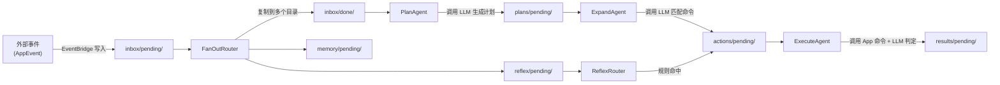

# 认知引擎架构

AuroraBot 的认知引擎（内部代号 CortexForge）是项目的核心。它的基本工作方式是：

- 外部事件以 JSON 文件的形式写入 `data/kernel/` 目录
- 文件落盘触发 `FileEvent`，通过事件总线广播
- 节点根据 `topology.yaml` 中的声明匹配事件，激活后执行，产出新文件
- 新文件再次触发下游节点

**挼挼如是说**

> 认知引擎不是"会说话的 AI"，是一个管道——一头接外部事件，另一头产出命令和结果。中间的节点各干各的活，互不相识，只靠文件来传递信息。

## 核心概念

### 文件

事件和认知状态都以 JSON 文件的形式存放在 `data/kernel/` 下。每条文件带路径约定：

| 目录模式           | 含义             |
| ------------------ | ---------------- |
| `inbox/pending/`   | 待处理的外部事件 |
| `inbox/done/`      | 已处理的外部事件 |
| `plans/pending/`   | 待展开的计划     |
| `actions/pending/` | 待执行的命令     |
| `results/pending/` | 执行结果         |
| `heartbeat/`       | 心跳脉冲         |
| `reflex/pending/`  | 待规则匹配的事件 |
| `memory/pending/`  | 待写入记忆的事件 |

### Node

代码中对应 `src/brain/kernel/base.py` 的 `Node` 抽象类。核心接口：

```python
class Node:
    id: str                     # 唯一标识
    guards: list[FilePattern]   # 监听的 glob 模式
    produces: list[FileDescriptor]  # 产出的文件路径

    def on_event(event) -> bool     # 事件匹配判断
    async def execute() -> list[FileUpdate]  # 执行逻辑
    async def run()                 # 主循环：等待事件 → 执行 → 落盘
```

每个节点运行独立的 `asyncio.Task`，通过 `asyncio.Event` 等待总线唤醒。

### 两类节点

| 类型     | 基类           | LLM 调用 | 说明                              |
| -------- | -------------- | -------- | --------------------------------- |
| `Agent`  | `Agent(Node)`  | 是       | 通过 `llm_chat()` 调用 LLM 做推理 |
| `Router` | `Router(Node)` | 否       | 纯逻辑（规则匹配、扇出、合并等）  |

### FileEventBus

代码中对应 `src/brain/kernel/event_bus.py`。核心机制：

1. `dispatch_forever()` 协程从 `asyncio.Queue` 取事件
2. 遍历所有节点调用 `on_event()`，匹配的节点标记为 `READY`
3. 节点被唤醒后执行 `execute()`，产出 `FileUpdate`
4. `apply_update()` 带锁写入文件，写入后自动 `publish` 新的 `FileEvent`

### Circuit

代码中对应 `src/brain/kernel/circuit.py`。职责单一：创建 `FileEventBus`，注入所有节点，管理 `dispatch_forever` 和各 `node.run()` 协程的生命周期。

## 当前启用的认知管线

`topology.yaml` 中 `enabled: true` 的节点构成以下流向：



### 短路径 (ReflexRouter)

绕过 LLM，直接做规则匹配。处理流程：

1. 读取 `reflexes/rules.json` 中的规则
2. 逐条匹配事件文本
3. 命中则直接构造 `action.json` → 送入 `ExecuteAgent`
4. 未命中则静默消费，事件仍走 Planner 长路径

### 长路径 (PlanAgent → ExpandAgent → ExecuteAgent)

调用 LLM 的全链路处理：

- **PlanAgent** — 收集 `inbox/done/` 中的事件，按 `session_id` 分组，调用 LLM 生成整合计划
- **ExpandAgent** — 读取计划，从 `host.list_command_specs()` 获取可用命令，调用 LLM 做语义匹配并构造参数
- **ExecuteAgent** — 调用 `host.invoke_command()` 执行命令，LLM 判断执行结果

## 已实现但未启用的节点

```yaml
- id: heartbeat # HeartbeatRouter — 定时自触发脉冲
- id: goal-generator # GoalGeneratorAgent — 沉默时主动生成意图
- id: reflex-learner # ReflexLearnerAgent — 从成功动作中学习新规则
```

## 下一步阅读

- 想了解具体的数据结构：读 [节点系统](./node-system.html)
- 想了解 Circuit 与 EventBridge 的协作细节：读 [内核运行时](./kernel-runtime.html)
- 想自己写节点：读 [认知节点开发](../develop/brain-node-development.html)
