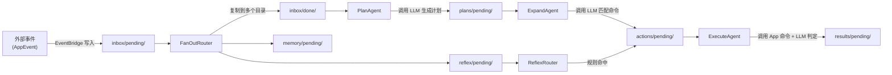

# 认知引擎架构

AuroraBot 的认知引擎（内部代号 CortexForge）是项目的核心。它由两个子系统构成:

| 子系统                | 文档                           | 职责                                           |
| --------------------- | ------------------------------ | ---------------------------------------------- |
| **kernel** (节点系统) | [节点系统](./node-system.md)   | Node / Agent / Router / FileEventBus / Circuit |
| **memory** (记忆系统) | [记忆系统](./memory-system.md) | L1 工作记忆 / L2 情景记忆 / L3 语义记忆        |

基本工作方式:

- 外部事件以 JSON 文件的形式写入 `data/kernel/` 目录
- 文件落盘触发 `FileEvent`，通过事件总线广播
- 节点根据 `topology.yaml` 中的声明匹配事件，激活后执行，产出新文件
- 新文件再次触发下游节点
- 认知管道中需要"记忆"的环节，节点通过 `UnifiedMemoryManager` 存取 L1/L2/L3 记忆

## 子系统概览

### kernel — 节点系统

认知管道的执行单元。详见 [节点系统](./node-system.md)。

- **Node** 抽象基类: `on_event()` 匹配文件事件 → `execute()` 执行逻辑 → 产出 `FileUpdate`
- **Agent** (LLM 驱动): PlanAgent、ExpandAgent、ExecuteAgent 等，调用 `llm_chat()` 做推理
- **Router** (纯逻辑): FanOutRouter、ReflexRouter、MemoryRouter 等，执行规则匹配和路由
- **FileEventBus**: 事件分发中枢，从 `asyncio.Queue` 取事件 → 匹配节点 → 唤醒执行
- **Circuit**: 生命周期管理器，托管 `dispatch_forever` 和所有 `node.run()` 协程

### memory — 记忆系统

为节点提供持久化记忆能力。详见 [记忆系统](./memory-system.md)。

- **L1 工作记忆**: 内存 FIFO 列表，最近 10 条，不持久化
- **L2 情景记忆**: JSON 文件追加，50 条后 LLM 压缩，按时间线检索
- **L3 语义记忆**: ChromaDB 向量存储，LLM 提取事实 → 语义相似度检索
- **UnifiedMemoryManager**: 统一入口，节点无需关心底层 L1/L2/L3 流转

## 文件路径约定

事件和认知状态都以 JSON 文件的形式存放在 `data/kernel/` 下:

| 目录模式           | 含义             |
| ------------------ | ---------------- |
| `inbox/pending/`   | 待处理的外部事件 |
| `inbox/done/`      | 已处理的外部事件 |
| `plans/pending/`   | 待展开的计划     |
| `actions/pending/` | 待执行的命令     |
| `results/pending/` | 执行结果         |
| `heartbeat/`       | 心跳脉冲         |
| `reflex/pending/`  | 待规则匹配的事件 |
| `memory/pending/`  | 待写入记忆的事件 |

## 当前启用的认知管线

`topology.yaml` 中 `enabled: true` 的节点构成以下流向：



### 短路径 (ReflexRouter)

绕过 LLM，直接做规则匹配。处理流程：

1. 读取 `reflexes/rules.json` 中的规则
2. 逐条匹配事件文本
3. 命中则直接构造 `action.json` → 送入 `ExecuteAgent`
4. 未命中则静默消费，事件仍走 Planner 长路径

### 长路径 (PlanAgent → ExpandAgent → ExecuteAgent)

调用 LLM 的全链路处理：

- **PlanAgent** — 收集 `inbox/done/` 中的事件，按 `session_id` 分组，调用 LLM 生成整合计划
- **ExpandAgent** — 读取计划，从 `host.list_command_specs()` 获取可用命令，调用 LLM 做语义匹配并构造参数
- **ExecuteAgent** — 调用 `host.invoke_command()` 执行命令，LLM 判断执行结果

## 已实现但未启用的节点

```yaml
- id: heartbeat # HeartbeatRouter — 定时自触发脉冲
- id: goal-generator # GoalGeneratorAgent — 沉默时主动生成意图
- id: reflex-learner # ReflexLearnerAgent — 从成功动作中学习新规则
```

## 下一步阅读

- 想了解节点数据结构与类型: 读 [节点系统](./node-system.html)
- 想了解记忆存储与检索: 读 [记忆系统](./memory-system.html)
- 想了解 Circuit 与 EventBridge 的协作细节: 读 [内核运行时](./kernel-runtime.html)
- 想自己写节点: 读 [认知节点开发](../develop/brain-node-development.html)
