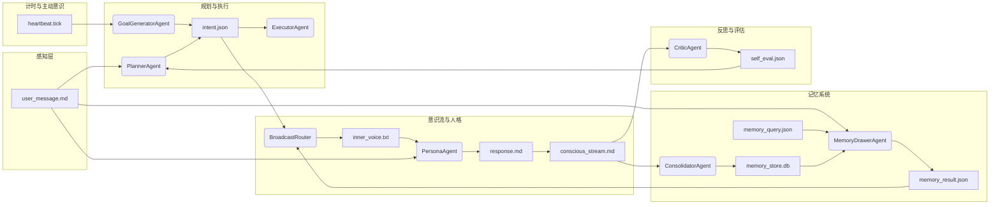

# 认知架构

Brain 层是 AuroraBot 的认知内核，代号 **CortexForge**。它不是一个具体的智能体应用，而是一个**用于生成智能体的底层操作系统**。其核心假设：

- 智能体的全部认知状态都表示为**文件**（超级多态变量）。
- 智能体的认知活动都建模为**节点**（Node），节点守护文件、被事件触发、产出新文件。
- 整个系统的协调通过**事件总线**完成，构成一张声明式的认知拓扑电路。

**挼挼如是说**

> 别把 Brain 想象成一个"AI 大脑"——它更像一间无限大的档案馆。每份文件都有自己的锁、版本号和读者登记册。工人们（节点）坐在各自的工位上，面前的文件篮一旦有东西滑入就开始工作，干完活把产出放进下一级文件篮。没有人喊"开工"，是文件本身在推动一切运转。

## 设计原则

1. **状态即文件** — 一切可变或不可变状态均以文件形式持久化，具备元信息、版本与锁。
2. **无状态节点** — 节点本身不保持运行内存状态（除 LLM 宿主上下文），节点实例可随时销毁与重建。
3. **静态依赖声明** — 节点的输入/输出文件在定义时即声明完毕，形成静态资源依赖图；运行时的通路由事件在图上动态寻找。
4. **事件驱动** — 文件变动通过事件总线广播，节点按模式订阅，自行决定是否激活。
5. **分层认知** — 认知过程分离为 **Agent**（需 LLM 的思考型节点）和 **Router**（纯机械化的反射型节点），共享统一基类。
6. **双上下文投影** — 系统支撑一个沉浸式人格主上下文（热认知池）和一个结构化认知上下文（冷认知池），通过 Router 翻译层连接。

## 核心概念

### 文件 — 第一等公民

文件是系统的全部数据流载体，不是"临时变量"——是**持久的、有版本的、加锁的**。

**多态性**：文件可以是 JSON、YAML、纯文本、向量索引、数据库分片等。

**元信息**：每个文件附带版本号、锁状态、消费者偏移和历史快照引用。

**代码中的对应**：

| 类               | 角色                                                 |
| ---------------- | ---------------------------------------------------- |
| `FileDescriptor` | 声明一个节点将产出的文件（路径、schema、锁策略）     |
| `FilePattern`    | 声明一个节点守护的文件模式（支持 glob 通配）         |
| `FileEvent`      | 文件变更事件（路径、变更类型、版本号、时间戳）       |
| `FileUpdate`     | 节点执行后产出的文件变更（描述符 + 内容 + 写入模式） |

### 节点 — 认知原子

一切认知逻辑的载体，分为两种派生类型，共享统一基类 `Node`。

**Node 基类**：

```
Node:
    id: str
    type: "agent" | "router"
    guards: List[FilePattern]    # 守护的文件模式
    produces: List[FileDescriptor]  # 产出的文件
    state: IDLE | READY | RUNNING | WAITING | ERROR | TERMINATED

    on_event(event) → bool    # 事件是否应激活本节点
    execute() → List[FileUpdate]  # 执行认知操作
    on_complete()              # 生命周期钩子
```

节点**无内部记忆**（除 Agent 可能持有的临时 LLM 上下文），每次执行后理论上可被回收。

#### Agent（认知型节点）

- 持有一个 LLM 宿主实例，执行时调用 LLM
- 通过 `think()` 方法调用统一 LLM 网关，自动注入系统提示词
- 执行过程中可能异步等待，时长不确定
- 产出为确定性文件，可通过版本控制回滚

#### Router（反射型节点）

- **零 LLM 调用**，纯逻辑门，执行时间可预测
- 是流程控制结构的原生载体：条件分支、多路汇集、扇出、终止信号等
- 已实现的 Router 类型：`SwitchRouter`、`WaitRouter`、`MergeRouter`、`HeartbeatRouter`、`ReflexRouter`、`FanOutRouter`、`TerminalRouter`、`MemoryAgent`（详见 [节点系统](./node-system.html)）

### 事件总线 — 神经束

文件变更通过事件总线广播，节点按模式订阅，自行决定是否激活。核心机制：

- **模式订阅** — 节点注册 `FilePattern`（glob），不直接监听物理路径
- **事件合并** — 对同一文件的连续快速变更进行窗口合并
- **优先级队列** — 用户交互等高优事件可抢占低优后台任务
- **事件溯源** — 所有事件顺序写入追加日志，用于事后调试与重演

### 锁机制

每份文件上压着一个锁章:

| 锁状态                | 含义                   |
| --------------------- | ---------------------- |
| `read_only`           | 只读，任何节点不可写入 |
| `write_overwrite`     | 可覆盖写入             |
| `append_only`         | 只允许追加             |
| `locked_by_<node_id>` | 被特定节点独占         |

### 静态依赖图 — 认知拓扑电路

节点与文件之间的读写关系构成一张**有向二分图**：

- 节点 → 产出文件（写边）
- 文件 → 守护节点（读边）

这张图在系统启动时由所有节点的 `guards` 和 `produces` 声明聚合而成。运行时的"通路"由事件在图上动态寻找——从变更的文件出发，沿读边找到所有订阅节点，激活后它们写新文件，再沿写边扩散。通路不是预先编好的脚本，而是动态激发的波前。



> 上图来自设计白皮书 `CortexForge 0.7`，展示的是目标态认知拓扑。当前实现的部分节点（ReflexRouter、SwitchRouter、WaitRouter、HeartbeatRouter、MergeRouter）已就位，其余节点正在逐步填充。

## 双上下文认知

AuroraBot 的认知系统天然分为两个池：

### 热认知池 — 人格主上下文

- 载体：`conscious_stream.md`（追加的散文式意识流）
- 由认知节点维护，呈现小光的人格、语气、记忆
- 沉浸式、连续、不可删除——这是她的"自我感"的来源

### 冷认知池 — 结构化认知上下文

- 载体：`intent.json`、`self_eval.json`、`memory_result.json` 等结构化文件
- 由 Agent 节点读写，Router 节点路由
- 工单式、可版本化、可回滚——这是她的"思考过程"

两个池通过 `BroadcastRouter` 连接：它将冷冰冰的结构化文件翻译成自然语言的内心独白，注入热认知池。

## 下一步阅读

- 想理解节点的设计细节：读 [节点系统](./node-system.html)
- 想理解内核调度：读 [内核运行时](./kernel-runtime.html)
- 想理解记忆系统：读 [统一联合记忆](./memory-system.html)
- 想看完整设计白皮书：[意识引擎架构白皮书](../appendix/cortex-forge-whitebook.html)
