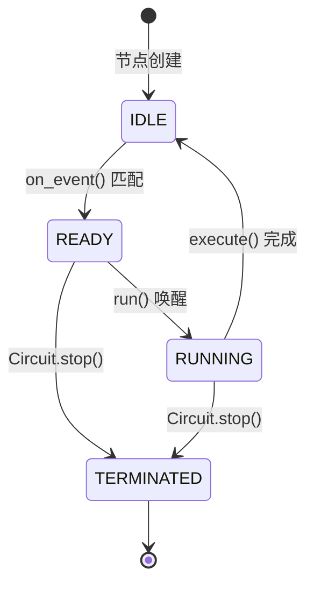

# 内核运行时

本文描述认知引擎的结构和启动后的运作方式

::: warning
源码 API 文档正在施工中...
:::

## 启动

[平台侧启动](./platform-runtime.md#启动) (discover → load config → register → on_start) 完成后，`startup_agent()` 继续初始化内核:

1. `build_circuit(app_host)` — 读 `topology.yaml`，通过 `NODE_REGISTRY` 实例化节点
2. `circuit.start()` — 启动 `dispatch_forever` 协程 + 各个 `node.run()` 协程
3. `circuit._bootstrap_heartbeat()` — 写入首个 `heartbeat/tick.json`，注入初始 `FileEvent`
4. `run_event_bridge()` — 创建 `asyncio.Task`，将 `ApplicationHost._events` 桥接到 `FileEventBus`

::: tip
仅在 `RUN_MODE` 为 `agent` / `core` / `prod` 时启动。平台侧的 `run_app_loop()` 启动逻辑见 [平台运行时](./platform-runtime.md#运行时)。
:::

## 运行时

`main.py` 通过 `asyncio.create_task` 创建 `run_event_bridge()` 协程，`Circuit` 内部另有一组协程:

### 1. 事件桥 — `run_event_bridge()`

```python
# src/brain/nodes/event_bridge.py

while not stop_event.is_set():
    events = host.drain_events()
    for event in events:
        file_path = f"inbox/pending/event_{type}_{id}.json"
        circuit.apply_update(FileUpdate(...), node_id="event_bridge")
    await asyncio.sleep(interval)
```

`apply_update()` 由 `FileEventBus` 执行：写文件 → 生成 `FileEvent` → `publish` 入队列。将平台侧产出的 `AppEvent` 转换为内核侧的文件事件，驱动认知电路运转。

::: tip
仅在 `RUN_MODE` 为 `agent` / `core` / `prod` 时启动。
:::

### 2. 认知电路 — `Circuit` + `FileEventBus`

`src/brain/kernel/circuit.py` + `src/brain/kernel/event_bus.py`

**启动**：

1. `FileEventBus(nodes)` 创建事件总线和 `asyncio.Queue`
2. `dispatch_forever()` 协程启动，持续从队列取事件
3. 每个节点创建 `node.run()` 协程，等待 `_ready_event` 被置位
4. `_bootstrap_heartbeat()` 注入初始脉冲

**运行时**：

```
FileEvent → dispatch_forever() 从队列取出
  → 遍历 nodes → on_event() 匹配?
      → 是 → state = READY → _ready_event.set()
              → node.run() 被唤醒 → execute() → [FileUpdate, ...]
                  → apply_update(update) 落盘 → publish 新 FileEvent → 回到顶部
      → 否 → 继续等待下一事件
```

## 节点生命周期



::: tip
Agent 在执行期间可能长时间等待 LLM 响应，期间状态保持 `RUNNING`。Router 执行时间可预测，通常毫秒级完成。
:::

## 文件写入与锁

`FileEventBus.apply_update()` 为每个文件路径维护一个 `asyncio.Lock`：

```python
async def apply_update(self, update, node_id):
    lock = self._get_lock(descriptor.path)
    async with lock:
        self._write_file(...)
    self.publish(FileEvent(path=descriptor.path, change_type="write"))
```

同一文件被多个节点并发写入时，`asyncio.Lock` 保证串行化。文件格式支持 `"json"` 和普通文本，json 模式下可选 `"append"` 模式（向数组追加元素）。

## 关闭

内核侧关闭顺序:

1. `_stop_event.set()` — 通知所有协程停止
2. `_bridge_task.cancel()` — 取消事件桥协程
3. `circuit.stop()` — 将所有节点标记 `TERMINATED`，取消各 `node.run()` 协程和 `dispatch_forever`

::: tip
平台侧的 `_app_task` 取消和 `app_host.stop_all()` 见 [平台运行时 - 关闭](./platform-runtime.md#关闭)。
:::
