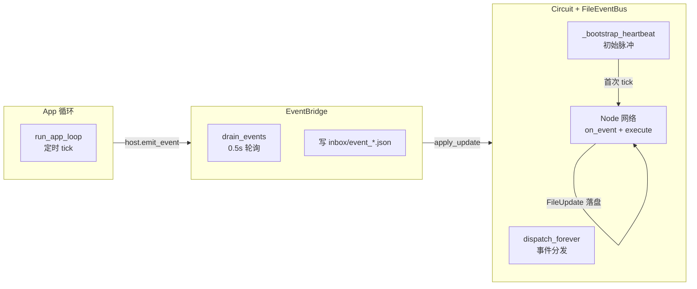

# 内核运行时

Kernel 是 AuroraBot 的调度心脏。认知拓扑电路（Circuit）通过文件事件总线驱动节点，应用事件经 EventBridge 桥接为文件事件，形成完整循环。旧调度器 `loop.py` 已被完全移除。

## 整体架构



## 三类并行的协程循环

Kernel 的核心由三个独立的 `asyncio.Task` 组成，在 `main.py` 启动时创建：

### ① App 循环 — `run_app_loop()`

每 `APP_FRAME_INTERVAL`（默认 1s）调用一次 `ApplicationHost.tick()`。`tick()` 遍历所有已注册 App 执行 `on_tick()`，App 在这期间自主感知外部变化（如 QQ 的新消息）并通过 `PlatformAPI.emit_event()` 上报。

仅在 `RUN_MODE` 包含 `app` / `application` / `prod` 时启动。

### ② EventBridge — `run_event_bridge()`

每 `HEARTBEAT_INTERVAL`（默认 0.5s）轮询 `ApplicationHost.drain_events()`。将积压的 `AppEvent` 序列化为 JSON 文件写入 `data/kernel/inbox/event_<type>_<id>.json`。文件落盘自动触发 `FileEvent` 注入总线，唤醒匹配的下游节点。

仅在 `RUN_MODE` 包含 `agent` / `core` / `prod` 时启动。

### ③ Node 电路 — `Circuit`

启动流程：

1. **构建**：`node_factory.py` 读取 `topology.yaml` 邻接表，根据 `type` 从 `NODE_REGISTRY` 分派构造器，创建所有节点实例
2. **装配**：`Circuit(nodes)` 创建 `FileEventBus`，注入了所有节点的 `_bus` 引用
3. **启动**：`circuit.start()` 启动 `dispatch_forever` 协程 + 每个 `node.run()` 协程
4. **自举**：`_bootstrap_heartbeat()` 写入初始 `heartbeat/tick.json`，注入首个 `FileEvent`，启动自持振荡

运行时每个周期：

```
FileEvent → dispatch_forever → 遍历 nodes → on_event() 匹配?
  └─ 是 → state = READY → _ready_event.set()
            └─ node.run() 被唤醒 → execute() → FileUpdate
                  └─ apply_update() 落盘 → publish 下游 FileEvent → 回到顶部
  └─ 否 → 继续等待下一事件
```

## 节点生命周期

```
IDLE ──on_event() 匹配──▶ READY ──调度到──▶ RUNNING ──execute() 完成──▶ IDLE
                            │                  │
                            │              WAITING (Agent LLM 等待中)
                            │                  │
                            │               ERROR (触发修复 Router)
                            │                  │
                            └──TERMINATED──◀──┘ (停止信号)
```

- `IDLE`：空闲，等待事件
- `READY`：事件匹配，等待调度器分配执行机会
- `RUNNING`：正在执行 `execute()`（Agent 可能在此状态长时间等待 LLM 响应）
- `WAITING`：执行中遇到异步等待（仅 Agent）
- `ERROR`：执行异常
- `TERMINATED`：节点/子图关闭

## HeartbeatRouter — 自主意识脉冲

`HeartbeatRouter` 是系统中的自持振荡器。它在 `execute()` 中等待 `interval_sec`（默认 300s）后写入新的 `heartbeat/tick.json` 并发布 `FileEvent`。这个脉冲驱动 `GoalGeneratorAgent` 在沉默过久时主动生成意图。

AuroraBot 从"回应用户的镜子"变成"会自己呼吸的生命体"——她不是因为有人说话才醒来，而是内部的钟摆从不停止。

## 拓扑配置

节点网络通过 `topology.yaml` 声明式配置：

```yaml
nodes:
  - id: heartbeat
    type: heartbeat
    config:
      interval_sec: 300

  - id: planner
    type: planner
    watch:
      - "inbox/event_*.json"
      - "intent/goal*.json"

  - id: priority-switch
    type: switch
    config:
      guard_pattern: "plans/plan_*.json"
      condition_field: "priority"
      condition_op: ">"
      condition_value: 70
```

节点间无需显式声明边——`watch`（监听的文件模式）和 `emit`（产出的文件路径）自动形成隐式有向边，邻接匹配即为通路。

## RUN_MODE 组合

| 模式            | App 循环 | EventBridge + Circuit |
| --------------- | -------- | --------------------- |
| `prod`          | ✅       | ✅                    |
| `app`           | ✅       | ❌                    |
| `application`   | ✅       | ❌                    |
| `agent`         | ❌       | ✅                    |
| `core`          | ❌       | ✅                    |

## 下一步阅读

- 想理解 Node 基类细节：读 [节点系统](./node-system.html)
- 想理解认知全貌：读 [认知架构](./brain-architecture.html)
- 想看节点邻接拓扑：[kernel-runtime-flow 流程图](../appendix/kernel-runtime-flow.html)
