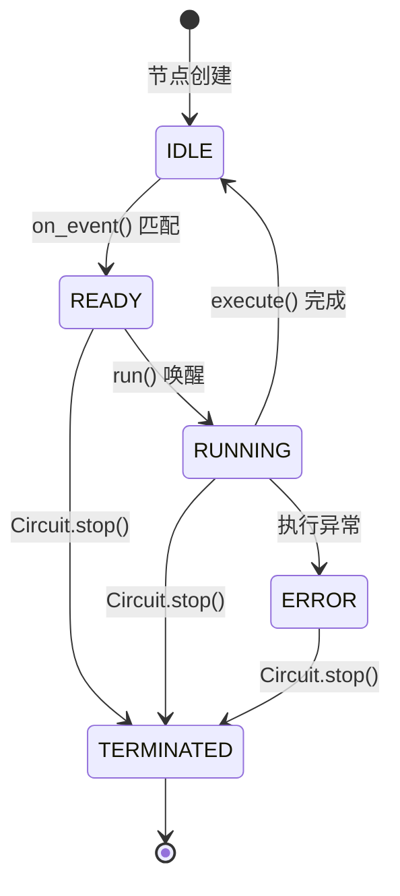

# 节点系统

节点系统是 CortexForge 认知引擎的 kernel 子系统。节点是文件驱动认知管道中的工作单元，`FileEventBus` 负责事件分发，`Circuit` 管理整个调度生命周期。

一个完整的认知周期:

```
FileEvent → FileEventBus.dispatch_forever() 从队列取出
  → 遍历 nodes → on_event() 匹配?
      → 是 → state = READY → node.run() 被唤醒
              → execute() → [FileUpdate, ...]
                  → FileEventBus.apply_update() 落盘 → publish 新 FileEvent
      → 否 → 继续等待下一事件
```

## 类的层次

```
Node (ABC)             # 抽象基类
├── Agent(Node)        # LLM 驱动型
└── Router(Node)       # 纯逻辑型
```

## Node 基类

```python
class Node:
    id: str                          # 唯一标识
    guards: List[FilePattern]        # 监听的 glob 模式列表
    produces: List[FileDescriptor]   # 产出的文件描述符列表

    def on_event(event) -> bool      # 事件匹配判断
    async def execute() -> list[FileUpdate]  # 执行逻辑
    async def run()                  # 主循环
```

::: tip
`Node.run()` 在被 `Circuit` 以 `asyncio.Task` 托管后循环等待 `_ready_event`，被总线置位后调用 `execute()`。
:::

## Agent

```python
class Agent(Node):
    def __init__(self, node_id, host=None, *, system_prompt="", memory=None):
        ...
```

持有 `_host`（ApplicationHost 引用）、`_system_prompt`（注入 LLM 的消息）、`_memory`（UnifiedMemoryManager 引用）。

::: tip
Agent 在执行时通常调用 `llm_chat()` 函数（`src/brain/ai/llm_gate.py`）——项目内所有 LLM 调用的唯一入口。
:::

## Router

```python
class Router(Node):
    ...
```

只是标记了 `type = "router"`。Router 的实现类不调用 LLM，执行纯机械逻辑。

## 文件相关数据结构

### FileDescriptor

```python
@dataclass(slots=True)
class FileDescriptor:
    path: str                    # 文件路径
    schema: str = "json"         # 格式（json / text）
    lock: str = "write_overwrite"# 锁策略
```

### FilePattern

```python
@dataclass(slots=True)
class FilePattern:
    pattern: str    # glob 模式，如 "inbox/event_*.json"

    def match(self, file_path: str) -> bool
```

### FileEvent

```python
@dataclass(slots=True)
class FileEvent:
    path: str                # 变更文件路径
    change_type: str         # 变更类型
    timestamp: str           # 时间戳
    version: int = 0
    metadata: dict = {}      # 含 source_node 等
```

### FileUpdate

```python
@dataclass(slots=True)
class FileUpdate:
    descriptor: FileDescriptor
    content: Any
    mode: str = "overwrite"   # overwrite / append
```

## 节点状态机



状态定义在 `NodeState` 枚举中: `IDLE`、`READY`、`RUNNING`、`WAITING`、`ERROR`、`TERMINATED`。`WAITING` 状态已在 `EventBridge` 和节点基类中使用 (用于慢路径主动等待)。

## FileEventBus — 事件总线

`src/brain/kernel/event_bus.py`

事件分发中枢，连接文件系统和节点。核心机制:

1. `dispatch_forever()` 协程从 `asyncio.Queue` 取 `FileEvent`
2. 遍历所有节点调用 `on_event()`，匹配的节点标记为 `READY` 并 `_ready_event.set()`
3. 节点被唤醒后执行 `execute()`，产出 `FileUpdate`
4. `apply_update()` 带 `asyncio.Lock` 写入文件，写入后自动 `publish` 新的 `FileEvent`

```python
# 写入带锁，保证同一文件并发安全
async def apply_update(self, update, node_id):
    lock = self._get_lock(descriptor.path)
    async with lock:
        self._write_file(...)
    self.publish(FileEvent(path=descriptor.path, change_type="write"))
```

文件格式支持 `"json"` 和普通文本，json 模式下可选 `"append"` 模式 (向数组追加元素)。

## Circuit — 电路管理器

`src/brain/kernel/circuit.py`

职责单一: 创建 `FileEventBus`，注入所有节点，管理 `dispatch_forever` 和各 `node.run()` 协程的生命周期。

**启动流程**:

1. `FileEventBus(nodes)` 创建事件总线和 `asyncio.Queue`
2. `dispatch_forever()` 协程启动，持续从队列取事件
3. 每个节点创建 `node.run()` 协程，等待 `_ready_event` 被置位
4. `_bootstrap_heartbeat()` 注入初始脉冲，激活第一个节点

**关闭**: `circuit.stop()` 将所有节点标记 `TERMINATED`，取消各 `node.run()` 协程和 `dispatch_forever`。

::: tip
Circuit 与 EventBridge 的完整协作流程见 [内核运行时](./kernel-runtime.md)。
:::

## 已实现的节点列表

`src/brain/nodes/agents/`：

| 文件                      | 注册名           | 职责                     |
| ------------------------- | ---------------- | ------------------------ |
| `plan_agent.py`           | `planner`        | LLM 将事件组整合为计划   |
| `expand_agent.py`         | `expander`       | LLM 将计划展开为命令调用 |
| `execute_agent.py`        | `executor`       | 调用命令并 LLM 判定结果  |
| `goal_generator_agent.py` | `goal_generator` | 沉默时主动生成意图       |
| `reflex_learner_agent.py` | `reflex_learner` | 从成功动作中提取规则     |

`src/brain/nodes/routers/`：

| 文件                  | 注册名      | 职责                      |
| --------------------- | ----------- | ------------------------- |
| `fanout_router.py`    | `fanout`    | 扇出事件到多个下游        |
| `reflex_router.py`    | `reflex`    | 规则匹配，直接产出 action |
| `switch_router.py`    | `switch`    | 条件分支                  |
| `merge_router.py`     | `merge`     | 归并多个文件              |
| `heartbeat_router.py` | `heartbeat` | 定时自触发脉冲            |
| `terminal_router.py`  | `terminal`  | 关闭子图、移入归档        |
| `memory_router.py`    | `memory`    | 写入三级记忆              |

## 设计约束

- Agent 不直接调用 LLM API — 走 `llm_chat()` 统一入口 (`src/brain/ai/llm_gate.py`)
- 节点间不直接通信，仅通过文件 (`FileEventBus`) 传递数据
- 节点无内部状态 (LLM 上下文除外)，`execute()` 后可回收
- 文件生命周期: `pending/` → `done/` → `archived/`
- 同一文件并发写入由 `FileEventBus.apply_update()` 的 `asyncio.Lock` 串行化

## 下一步阅读

- 想看完整的认知拓扑图: 读 [认知引擎架构](./brain-architecture.html)
- 想了解记忆系统: 读 [记忆系统](./memory-system.html)
- 想理解调度机制: 读 [内核运行时](./kernel-runtime.html)
- 想自己写节点: 读 [认知节点开发](../develop/brain-node-development.html)
