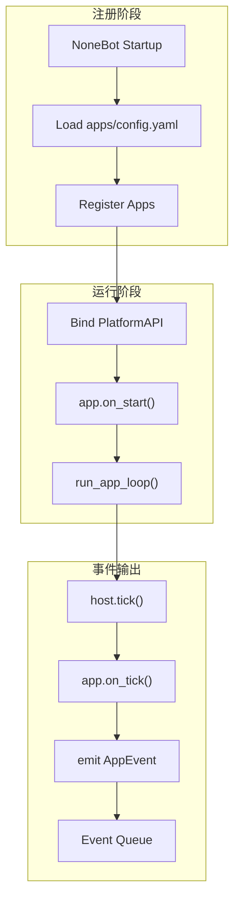

# 平台运行时

本文描述 `src/main.py` 启动后平台的运作方式。

## 体系总述

`platform`：

- 找到启用的应用，把它们运行起来
- 读 `manifest.yaml`，搞清楚每个 app 能干什么
- 给每个 app 塞一根 `PlatformAPI` 的管子
- 把命令记在表上、把事件排进队列
- 管理 app 从启动到停止的完整生命周期

`Apps`：

- 从外面接收输入
- 把输入变成标准化事件扔出去
- 暴露干脆利落的命令
- 管好自己的小仓库

::: tip
所以说，App 就像是 **传感器 + 执行器**
:::

## 启动链路

## 核心对象

### `ApplicationHost` — 宿主管家

`ApplicationHost` 是 app 们的房东，目前身兼数职：

- 管着所有 app 实例
- 管着命令注册表
- 管着事件队列

已经提供的接口：

- `register()` — 注册 app 实例
- `tick()` — 驱动所有 app 执行一个周期
- `stop_all()` — 停止全部应用
- `drain_events()` — 取出积压事件
- `invoke_command()` — 调用指定 app 的命令

### `PlatformAPI` — 管子

这是平台塞给每个 app 的万能插座。app 通过它跟外界打交道：

- `emit_event()` — 喊一嗓子："出事了！"
- `register_command()` — "我会干这个"
- `data_dir` — 我的小仓库
- `package` — 我是谁
- `log()` — 记个日志

## 内建应用概览

| App     | 靠什么知道外面的事    | 能干什么                    | 会喊什么                         | 自己存什么                   |
| ------- | --------------------- | --------------------------- | -------------------------------- | ---------------------------- |
| `qq`    | NoneBot `on_message`  | 发群消息、发私聊、群内 @ 人 | `message.received`               | `qq_events.json` 之类        |
| `alarm` | 时间轮询、`on_tick()` | `set_alarm` 设闹钟          | `alarm_reminder`、`diary_prompt` | `alarms.json`、`config.json` |
| `diary` | 被命令叫醒            | `write_diary` 写日记        | `diary.written`                  | `diaries.json`               |

::: info
内建应用还在持续迭代中，后续版本将逐步完善功能。
:::

## 下一步阅读

- 想写自己的应用：读 [App 开发指南](../develop/app-development.html)
