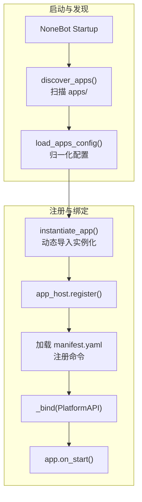
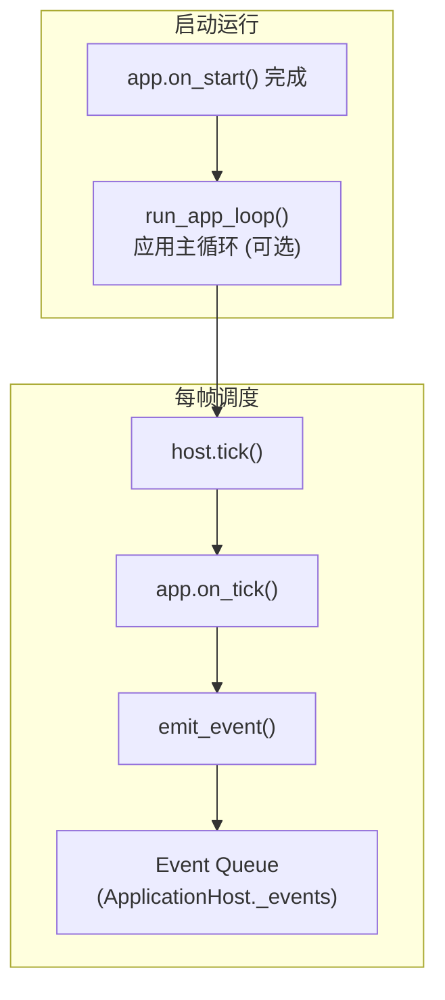

# 平台运行时

本文描述平台部分的结构和启动后的运作方式

::: warning
源码 API 文档正在施工中...
:::

## 启动

1. `discover_apps()` 扫描 `apps/` 目录，识别同时包含 `manifest.yaml` 和 `__init__.py` 的合法应用
2. 加载 `apps/config.yaml`，归一化配置，按 `enabled` 字段筛选要启动的应用
3. `instantiate_app()` 动态导入模块并实例化 Application 对象，注入启动参数
4. `app_host.register()` 加载 `manifest.yaml`，注册命令到命令表，通过 `_bind()` 注入 `PlatformAPI`，最后调用 `app.on_start()`
5. 管理 app 从启动到停止的完整生命周期

**图解**



## 运行时

`app.on_start()` 完成后，`run_app_loop()` 进入主循环，按固定帧间隔驱动所有 App:

```python
# src/platform/loop.py
while not stop_event.is_set():
    await host.tick()       # 遍历所有 App → app.on_tick()
    await asyncio.sleep(interval)
```

每帧调用 `host.tick()` → 各 App 的 `app.on_tick()` → App 通过 `PlatformAPI.emit_event()` 将 `AppEvent` 推入 `ApplicationHost._events` 双端队列。至此平台侧的事件生产完成，事件由 [内核运行时](./kernel-runtime.md) 的事件桥消费处理。

::: tip
仅在 `RUN_MODE` 为 `app` / `application` / `prod` 时启动 `run_app_loop()`。若 `RUN_MODE` 包含 `agent` / `core`，则同时启动 `Circuit + EventBridge`，详见 [内核运行时](./kernel-runtime.md)。
:::

**图解**



## 核心对象

### `ApplicationHost` 应用宿主

`ApplicationHost` 是 app 们的房东，目前身兼数职：

- 管着所有 app 实例
- 管着命令注册表
- 管着事件队列

已经提供的接口：

- `register()` — 注册 app 实例
- `tick()` — 驱动所有 app 执行一个周期
- `stop_all()` — 停止全部应用
- `drain_events()` — 取出积压事件
- `invoke_command()` — 调用指定 app 的命令

### `PlatformAPI` — 管子

这是平台塞给每个 app 的万能插座。app 通过它跟外界打交道：

- `emit_event()` — 喊一嗓子："出事了！"
- `register_command()` — "我会干这个"
- `data_dir` — 我的小仓库
- `package` — 我是谁
- `log()` — 记个日志

## 关闭

`shutdown_agent()` 中平台侧的收尾顺序:

1. `_stop_event.set()` — 通知 `run_app_loop()` 主循环停止
2. 取消内核侧任务 (bridge / circuit, 详见 [内核运行时 - 关闭](./kernel-runtime.md#关闭))
3. `_app_task.cancel()` — 取消 `run_app_loop()` 协程
4. `app_host.stop_all()` — 遍历所有 App 调用 `app.on_stop()`，清空实例、命令表、事件队列

## 内建应用概览

| App     | 靠什么知道外面的事    | 能干什么                    | 会喊什么                         | 自己存什么                   |
| ------- | --------------------- | --------------------------- | -------------------------------- | ---------------------------- |
| `qq`    | NoneBot `on_message`  | 发群消息、发私聊、群内 @ 人 | `message.received`               | `qq_events.json` 之类        |
| `alarm` | 时间轮询、`on_tick()` | `set_alarm` 设闹钟          | `alarm_reminder`、`diary_prompt` | `alarms.json`、`config.json` |
| `diary` | 被命令叫醒            | `write_diary` 写日记        | `diary.written`                  | `diaries.json`               |

::: info
内建应用还在持续迭代中，后续版本将逐步完善功能。
:::

## 下一步阅读

- 想了解认知引擎如何处理事件: 读 [内核运行时](./kernel-runtime.html)
- 想了解认知引擎总体结构: 读 [认知引擎架构](./brain-architecture.html)
- 想写自己的应用: 读 [App 开发指南](../develop/app-development.html)
