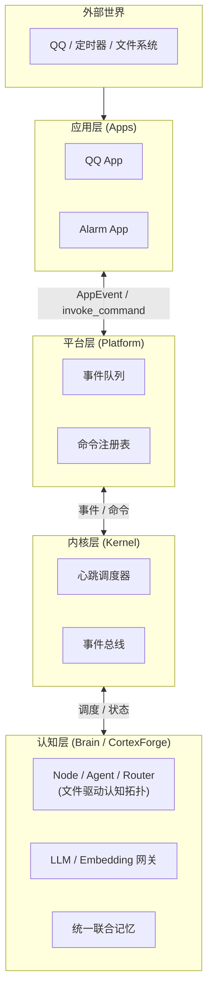

# 架构总览

| 层级       | 主要职责                                       | 关注点                     |
| ---------- | ---------------------------------------------- | -------------------------- |
| `apps`     | 感知外部输入、暴露原子命令、维护私有状态       | 接平台、接 SDK、做具体动作 |
| `platform` | 发现应用、注册命令、维护事件队列、调度生命周期 | 维护应用运行状态和生命周期 |
| `kernel`   | 注册节点、组织有向有环图、调度生命周期         | 决定下一步做什么           |
| `brain`    | Agent 节点网络、LLM 网关、统一联合记忆         | 内建认知能力               |

**挼挼如是说**

> 打个比方：app 是记者（在外面跑、采集信息），platform 是编辑部（安排版面、排期），kernel 是排班经理（决定今天谁干活、先干啥），brain 是主编团队（真正动脑子写稿子）。各层各司其职，谁也不越界。

## 总体链路

## 四层的职责

### App 层 — 感官和手脚

App 是"环境的感知器与执行器"。

- 接入外部世界，如 QQ、闹钟、文件系统
- 注册命令，供上层在需要时调用
- 维护自己的持久化数据
- 把外部变化转换为标准化 `AppEvent`

### Platform 层 — 身体

Platform 是"应用的运行时宿主"。

- 发现并实例化应用
- 解析 `manifest.yaml`
- 注入 `PlatformAPI`
- 维护命令注册表与事件队列
- 负责与上下层（App <-> Kernel）的双向通信
- 负责与维护应用的生命周期

### Kernel 层 — 心跳

Kernel 是"心跳"。

- 编排和组织 Brain 中的节点(Node)
- 维护文件事件总线, 分发事件消息
- 维护节点的生命周期
- 编排命令流，通过 Platform 分发执行

### Brain 层 — 大脑

Brain 是"内建认知能力层"。

- 全部认知状态以文件形式持久化，具备元信息、版本与锁
- Node / Agent / Router 三类节点构成有向二分图（文件 <-> 节点）
- 事件总线广播文件变更，节点按 glob 模式订阅并自行激活
- 统一 LLM 网关与 Embedding 网关
- 统一联合记忆（图式事实记忆 + 情景记忆 + 知识图谱经验记忆）
- 双上下文认知：热认知池（人格主上下文）+ 冷认知池（结构化工单）
- 未来开放认知节点插件，供第三方扩展认知能力

## 设计原则

1. `app` 只负责感知和执行，不替 brain 做认知
2. `platform` 只负责把系统跑起来和双向通信，不替 kernel 做调度决策
3. `kernel` 只负责调度与编排，不直接碰 app 的私事，不执行具体认知任务
4. `brain` 负责所有 LLM 推理、记忆存取与节点间认知流转
5. App 私有数据归 App 自己管
6. 事件流与命令流保持分离——各走各的道

## 下一步阅读

- 想了解平台与应用之间的契约：读 [平台运行时](./platform-runtime.html)
- 想了解认知的架构：读 [认知架构](./brain-architecture.html)
- 想了解记忆如何设计：读 [统一联合记忆](./memory-system.html)
