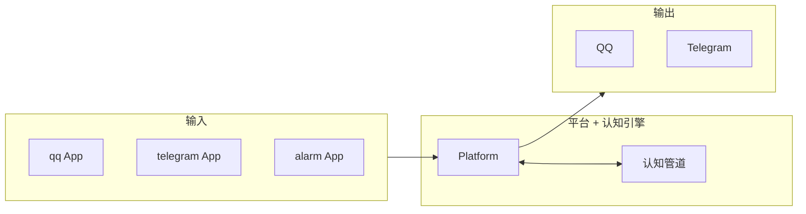

# 关于多IM接入

## 当前状态

当前版本**仅接入 QQ**。AuroraBot 的 App 体系在设计上支持水平扩展，接入新平台只需编写对应的 App。

| 层面   | 当前状态                            |
| ------ | ----------------------------------- |
| 应用   | 仅 `apps/qq` 一个 IM App            |
| 适配器 | 仅加载 `nonebot-adapter-onebot` v11 |

## 扩展方式

接入新平台分为两步：

1. **编写 App** — 参照 `apps/qq`，关注接收该平台消息 + 转为 `AppEvent`
2. **加载适配器** — 在依赖中声明对应适配器

所有 App 共享同一个认知引擎和记忆系统，跨平台上下文无缝衔接。

::: tip
对 AuroraBot 而言，多IM接入的关键不是框架能力，而是**为每个平台编写对应的 App**。
:::

## 架构示意

- 同一认知引擎处理多平台输入
- 三级记忆在所有平台间共享
- App 只负责感知和执行，不参与决策
