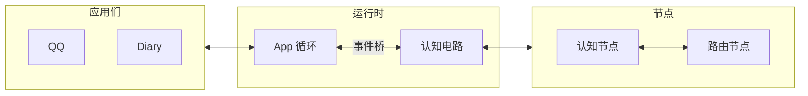

# 项目总览

AuroraBot 是一个基于 NoneBot2 的智能体框架。项目将系统划分为三个职责区域：

- **应用** (`apps`) 负责感知外部输入、暴露可调用的命令
- **平台** (`platform`) 负责管理 App 的注册、生命周期、事件与命令
- **认知** (`brain`) 负责组织包括事件桥、节点、记忆系统等有关认知的组件

::: tip
**CortexForge** 为认知引擎的内部代号。其分为两个部分:

- **内核**: 现阶段为 **kernel-α** 内核, 认知电路拓扑结构不够完善, 会逐步集成更多认知节点。
- **记忆**: 现阶段为 **memory-α** 记忆系统, 为三级联合记忆存储与检索。

:::

**挼挼如是说**

> 在 AuroraBot 之前, 挼挼其实已经写完了一个叫 Bot-Polaris 的项目. 由于其过于逆天的耦合程度, 导致其虽然效果不错, 但是维护成本极高. 最终挼挼决定投身 AuroraBot 的开发, 致力于构建一个兼容现有生态, 又能做出差异化创新的智能体框架。

## 运行时



启动后 `main.py` 创建两个 `asyncio.Task`：

- **App 循环** — 定时 `host.tick()`，遍历所有 App 的 `on_tick()`
- **事件桥** — 轮询 `host.drain_events()`，将 `AppEvent` 转为 JSON 写入 `data/kernel/`，文件落盘自动触发节点执行

`Circuit` 启动时内部创建 `dispatch_forever` 协程 + 每个节点的 `run()` 协程。节点按 `topology.yaml` 配置自动连边，通过文件模式隐式确定上下游。

## 认知电路

::: warning
当前内核为 **kernel-α** 内核, 认知电路拓扑结构不够完善, 会逐步集成更多认知节点。
:::

拓扑配置中 `enabled: true` 的节点：

```
外部事件 → FanOutRouter → ReflexRouter（短路径：规则命中直接响应）
                        → PlanAgent → ExpandAgent → ExecuteAgent（长路径：LLM 全链路）
```

- **FanOutRouter** — 将 inbox 事件扇出到下游 pending 目录
- **ReflexRouter** — 纯规则匹配，命中则直接产出 action（零 LLM）
- **PlanAgent** — 调用 LLM 将事件组整合为计划
- **ExpandAgent** — 调用 LLM 将计划展开为具体的命令调用
- **ExecuteAgent** — 调用 App 命令执行，LLM 判定结果

三个节点（`HeartbeatRouter` / `GoalGeneratorAgent` / `ReflexLearnerAgent`）已在代码中实现但拓扑配置中处于禁用状态。

## 已经具备的能力

- 应用发现、注册、生命周期管理（`ApplicationHost` + `PlatformAPI`）
- 文件事件总线 + 节点调度循环（`Circuit` + `FileEventBus`）
- 声明式拓扑配置（`topology.yaml` 邻接表）
- 基础应用已实现：QQ 接入、Alarm、Diary、Clock、Example
- 三级记忆系统（L1 工作记忆 / L2 情景记忆 / L3 语义记忆）

## 当前边界

- 仅支持 QQ 接入（通过 NapCat + onebot 适配器）
- 认知节点体系可扩展，但尚无插件化标准和开发工具链
- 部分应用未完整实现

## 下一步

- 想了解代码结构：[架构总览](../architecture/system-overview.html)
- 想跑起来：[快速开始](./getting-started.html)
- 想写 App：[App 开发指南](../develop/app-development.html)
