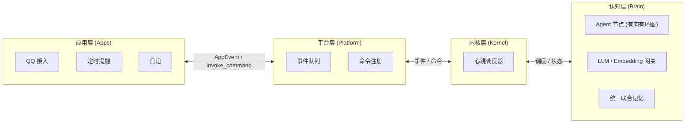

# 项目总览

AuroraBot 是一个基于 NoneBot2 框架的再封装框架, 她采用四层解耦架构：**应用层** (`apps`) 感知与执行、**平台层** (`platform`) 管理与通信、**内核层** (`kernel`) 调度与编排、**认知层** (`brain`) 认知与记忆。

**挼挼如是说**

> AuroraBot 的核心目标是：将四层完全解耦，并通过巧妙的架构设计，自然形成内驱式循环。

## 系统分层

- **`apps`** — 她的感官和手脚，负责感知世界、执行动作
- **`platform`** — 她的身体，负责把感官都安排好、让它们好好工作
- **`kernel`** — 她的心跳，负责调度节奏、编排认知事件流与组织认知内核
- **`brain`** — 她的大脑，基于文件驱动、事件总线与声明式认知拓扑网络的内核

## 架构总览

::: tip
此图在 [架构总览](../architecture/system-overview.html) 中亦有记载
:::

## 已经具备的能力

- 平台层全线畅通：应用发现、注册、生命周期管理、事件队列、命令调度均已完成
- 内核层 CortexForge 电路已运行：`Circuit` + `FileEventBus` + `EventBridge`，`topology.yaml` 声明式配置
- 认知节点体系已就绪：`PlanAgent` / `ExpandAgent` / `ExecuteAgent` 全链路 + `HeartbeatRouter` 自主脉冲 + `ReflexRouter` 短路径响应
- 多个 Router 类型已实现：`SwitchRouter` / `WaitRouter` / `MergeRouter` / `FanOutRouter` / `TerminalRouter`
- 基础应用已实现：QQ 接入、Example 应用，Alarm/Diary 框架可用

## 适合的场景

- 养赛博妹妹
- 养赛博女鹅
- 个人助手 (类似 [AstrBot](https://astrbot.app/) , [OpenClaw](https://openclaws.io/zh/))

::: tip
当前版本仅支持 QQ 接入，后续版本将支持更多平台。且个人助手的支持不是第一目标, 可能会长期搁置。
:::

## 边界与限制

- 统一联合记忆（mem0）整合正在推进中，当前使用 JSON 文件过渡方案
- 认知节点体系已可扩展（见 [认知节点开发](../develop/brain-node-development.html)），但插件标准化和工具链尚在完善
- 部分预装应用可能没有完整实现，可以关注后续版本
